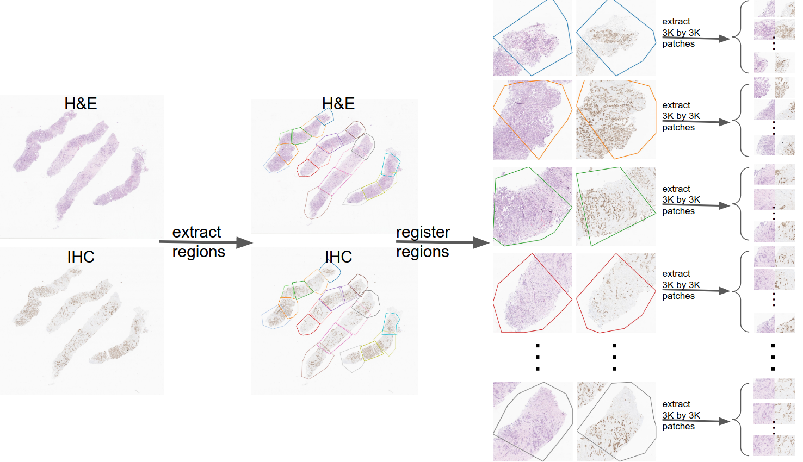

# Before Attempting to Download ....

Please read this section before attempting to download the dataset.

The dataset contains near 2 TB of images which are uploaded to [pcloud](https://www.pcloud.com/), in the following address:

https://filedn.com/laHPyhQ5wAHBUyNr64yhV0Q/IHC4BC_Dataset/

Pcloud has a limited download quota to be deducted from either the uploader's or the downloader's limit.
These limits are reset monthly for each user.
So if you failed to download the images due to the uploader's download quota being exceeded, you can create a pcloud free account with a basic download quota.
If that basic quota didn't suffice, you can buy a paid pcloud account.

Alternatively, you can download the compressed version of the images from Kaggle, which are rougly 50 Gb.

https://www.kaggle.com/datasets/akbarnejad1991/ihc4bc-compressed

The labels are maintained in the following repository, and are a couple of gigabytes in total.

https://gitlab.com/ihc4bc-dataset/labels/-/tree/main/  

**We may correct or add labels to the above repository, so please pull frequently to have access to the latest version of labels.**

# About

The below figure illustrates how the patch-pairs in the dataset are obtained.

When registering WSI pairs we learned that there is no rigid registration that can perfectly register two WISs. Therefore, we
firstly annotated region-pairs from the two WSIs (the step labeled
as ”extract regions” in the above figure). Afterwards, we registered each region-pair manually
(in the above figure this step is labeled as ”register regions”). Afterwards, we traversed
each region-pair with a stride of 1500 and extracted patch-pairs. The final
result of this step is a set of patch-pairs each of which are 3000 by 3000 (the
pairs in the right side of the figure).

Roughtly ~150K patch-pairs were extracted from ~240 WIS pairs. Consequently, DAB analysis was done on the H-DAB images (except for Her2/neu).
These ~150K pair were exhaustively inspected and around 60K pairs were discarded due to unreliablity of DAB analysis results.
Finally ~90K patch-pairs made it to the IHC4BC dataset.
For more details please refer to our paper.

# Format
The labels in the csv files are in the following format. The first column is the name of the image. 
The second column is the manual annotation (during the visual inspection); "a" means that the result of DAB-analysis looked reliable to the annotator.
"0" means the annotator has manually set the label to 0, and "d" means the annotator has discarded the image from the dataset (those pairs are not uploaded to pcloud).
The third column is the number of nuclei in the H&E patch, which - as explained in the paper - can be used as the denominator when computing H-score or percentage.
The rest of numbers in each row are the average DAB channel within each and every nucleus in the H-DAB modality.  
Image names are in the following format: "xxx_caseid_regionindex_rowindex_colindex.png". "caseid" is the unique number assigned to each patient.
"regionindex" is the index of the region from which the patch is extracted. 
"rowindex" and "colindex" are the row and column indices of the patch within that WSI region.
For example, the image '0_1010_11_1_2.png' corresponds to a patient with unique ID 1010, from region 11 of the WSI, and row 1 and column 2 of that WSI-region.      

# Citation 
If you use this dataset please cite the following paper:

Amir Akbarnejad, Nilanjan Ray, Penny J. Barnes, Gilbert Bigras. Predicting Ki67, ER, PR, and HER2 Statuses from H&E-stained Breast Cancer Images. arXiv:2308.01982. 

# Issues
Please report issues to the following address, and help us improve the dataset

ah8 [at] ualberta [dot] ca

# Acknowledgements

This work was supported by Mitacs accelerate. The experiments of this study were enabled in part by the Digital Research Alliance of Canada. We would like to thank DynaLIFE Medical Laboratory (Edmonton, Canada) for their support in the slide scanning process. 
 
